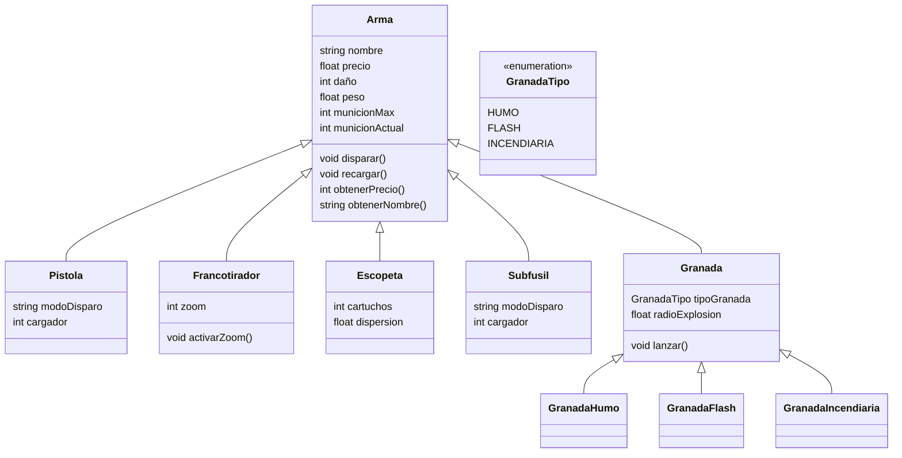

# Documentación del diagrama de clases

## 1. Descripción general

El sistema modela diferentes tipos de **armas** mediante una jerarquía de clases. La clase `Arma` funciona como clase base, de la cual heredan:

- `Pistola`
- `Francotirador`
- `Escopeta`
- `Subfusil`
- `Granada`

A su vez, la clase `Granada` tiene tres especializaciones:

- `GranadaHumo`
- `GranadaFlash`
- `GranadaIncendiaria`

También se define la enumeración `GranadaTipo`, que representa los diferentes tipos de granadas.

---

## 2. Diagrama de clases



---

## 3. Clase `Arma`

`Arma` es la clase principal del sistema. Contiene las características y operaciones comunes a todos los tipos de armas.

### Atributos

| Atributo | Tipo | Descripción |
|---|---|---|
| `nombre` | `string` | Nombre del arma. |
| `precio` | `float` | Precio del arma. |
| `daño` | `int` | Cantidad de daño que produce el arma. |
| `peso` | `float` | Peso del arma. |
| `municionMax` | `int` | Cantidad máxima de munición. |
| `municionActual` | `int` | Cantidad actual de munición disponible. |

### Métodos

| Método | Retorno | Descripción |
|---|---|---|
| `disparar()` | `void` | Ejecuta el disparo del arma. |
| `recargar()` | `void` | Recarga el arma. |
| `obtenerPrecio()` | `int` | Obtiene el precio del arma. |
| `obtenerNombre()` | `string` | Obtiene el nombre del arma. |

---

## 4. Clase `Pistola`

`Pistola` representa un arma de tipo pistola y hereda las características y operaciones de `Arma`.

### Herencia

```text
Arma
 └── Pistola
```

### Atributos

| Atributo | Tipo | Descripción |
|---|---|---|
| `modoDisparo` | `string` | Define el modo de disparo de la pistola. |
| `cargador` | `int` | Capacidad del cargador. |

No define métodos adicionales en el diagrama, por lo que utiliza los métodos heredados de `Arma`.

---

## 5. Clase `Francotirador`

`Francotirador` representa un arma especializada en disparos a larga distancia.

### Herencia

```text
Arma
 └── Francotirador
```

### Atributos

| Atributo | Tipo | Descripción |
|---|---|---|
| `zoom` | `int` | Nivel de aumento disponible para apuntar. |

### Métodos

| Método | Retorno | Descripción |
|---|---|---|
| `activarZoom()` | `void` | Activa el zoom del francotirador. |

---

## 6. Clase `Escopeta`

`Escopeta` representa un arma de tipo escopeta y hereda de `Arma`.

### Herencia

```text
Arma
 └── Escopeta
```

### Atributos

| Atributo | Tipo | Descripción |
|---|---|---|
| `cartuchos` | `int` | Cantidad de cartuchos disponibles. |
| `dispersion` | `float` | Nivel de dispersión de los disparos. |

No define métodos adicionales en el diagrama.

---

## 7. Clase `Subfusil`

`Subfusil` representa un arma automática de tamaño reducido y hereda de `Arma`.

### Herencia

```text
Arma
 └── Subfusil
```

### Atributos

| Atributo | Tipo | Descripción |
|---|---|---|
| `modoDisparo` | `string` | Define el modo de disparo del subfusil. |
| `cargador` | `int` | Capacidad del cargador. |

No define métodos adicionales en el diagrama.

---

## 8. Clase `Granada`

`Granada` representa un arma que se lanza y sirve como clase base para los diferentes tipos de granadas.

### Herencia

```text
Arma
 └── Granada
      ├── GranadaHumo
      ├── GranadaFlash
      └── GranadaIncendiaria
```

### Atributos

| Atributo | Tipo | Descripción |
|---|---|---|
| `tipoGranada` | `GranadaTipo` | Indica el tipo de granada. |
| `radioExplosion` | `float` | Radio de efecto o explosión de la granada. |

### Métodos

| Método | Retorno | Descripción |
|---|---|---|
| `lanzar()` | `void` | Ejecuta el lanzamiento de la granada. |

---

## 9. Clase `GranadaHumo`

`GranadaHumo` es una especialización de `Granada` destinada a producir humo.

### Herencia

```text
Arma
 └── Granada
      └── GranadaHumo
```

La clase no agrega atributos ni métodos propios en el diagrama.

---

## 10. Clase `GranadaFlash`

`GranadaFlash` es una especialización de `Granada`.

### Herencia

```text
Arma
 └── Granada
      └── GranadaFlash
```

La clase no agrega atributos ni métodos propios en el diagrama.

---

## 11. Clase `GranadaIncendiaria`

`GranadaIncendiaria` es una especialización de `Granada`.

### Herencia

```text
Arma
 └── Granada
      └── GranadaIncendiaria
```

La clase no agrega atributos ni métodos propios en el diagrama.

---

## 12. Enumeración `GranadaTipo`

`GranadaTipo` es una enumeración que define los tipos de granada disponibles.

### Valores

| Valor | Descripción |
|---|---|
| `HUMO` | Representa una granada de humo. |
| `FLASH` | Representa una granada flash. |
| `INCENDIARIA` | Representa una granada incendiaria. |

### Representación

```text
GranadaTipo
----------------
<<enumeration>>
HUMO
FLASH
INCENDIARIA
```

---

## 13. Relaciones de herencia

El diagrama utiliza **herencia** entre las clases mediante una relación de generalización.

La estructura completa es:

```text
                         Arma
                          │
        ┌─────────────────┼─────────────────┐
        │        │        │        │        │
     Pistola  Francotirador Escopeta Subfusil Granada
                                             │
                              ┌──────────────┼──────────────┐
                              │              │              │
                       GranadaHumo    GranadaFlash    GranadaIncendiaria
```

En Mermaid, estas relaciones se expresan mediante:

```mermaid
Arma <|-- Pistola
Arma <|-- Francotirador
Arma <|-- Escopeta
Arma <|-- Subfusil
Arma <|-- Granada

Granada <|-- GranadaHumo
Granada <|-- GranadaFlash
Granada <|-- GranadaIncendiaria
```

---

## 14. Resumen de clases

| Clase | Hereda de | Característica principal |
|---|---|---|
| `Arma` | — | Clase base para todas las armas. |
| `Pistola` | `Arma` | Tiene modo de disparo y cargador. |
| `Francotirador` | `Arma` | Tiene zoom y puede activarlo. |
| `Escopeta` | `Arma` | Tiene cartuchos y dispersión. |
| `Subfusil` | `Arma` | Tiene modo de disparo y cargador. |
| `Granada` | `Arma` | Tiene tipo, radio de explosión y puede lanzarse. |
| `GranadaHumo` | `Granada` | Especialización de granada de humo. |
| `GranadaFlash` | `Granada` | Especialización de granada flash. |
| `GranadaIncendiaria` | `Granada` | Especialización de granada incendiaria. |
| `GranadaTipo` | — | Enumeración de tipos de granada. |

---

## 15. Estructura del proyecto Java

Una posible organización de los archivos sería:

```text
src/
├── Arma.java
├── Pistola.java
├── Francotirador.java
├── Escopeta.java
├── Subfusil.java
├── Granada.java
├── GranadaHumo.java
├── GranadaFlash.java
├── GranadaIncendiaria.java
└── GranadaTipo.java
```

> **Nota:** Esta documentación mantiene la estructura del diagrama original, incluyendo sus nombres, atributos, métodos y relaciones de herencia.
